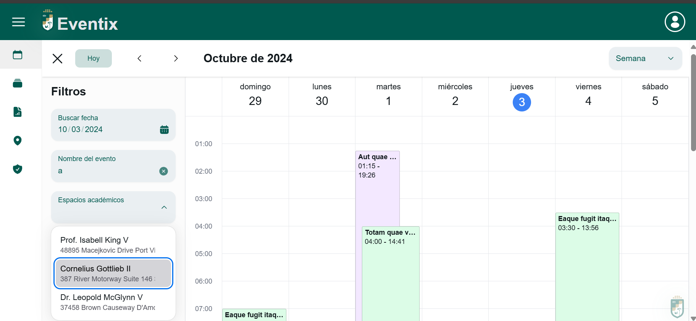

<div style="margin-bottom:10px">
    
    <span style="font-size:30px; font-weight:bold; line-height:1;">Eventix</span>
</div>



# Introducción

Eventix es una plataforma opensource que busca facilitar los procesos de agendamiento e inscripción a actividades con un enfoque particular con las actividades académicas.

Dentro de las funcionalidades estrellas tenemos:

✨ Renderizado de calendario
✨ Constructor de formularios
✨ Generación de reportes de asistencia
✨ Generación de reportes de formularios dinámicos

Sin hablar de una UX/UI pensada para las instituciones académicas.

## Cómo está construido

El proyecto está levantado con <b>Laravel + Inertia + ReactJs + Typescript</b> por lo que aconsejamos profundamente revisar la documentación de cada uno estos para entender más sobre la filosofía de cada uno.

Adicional, el proyecto cuenta con los paquetes:

-   Laravel Spatie para el manejo de roles y permisos.
-   NextUI para la mayoria de componentes base utilizados.
-   TailwindCSS para el manejo de estilos.
-   React Pro Sidebar para la generación de sidebars.
-   tightenco/ziggy para manejar los alias de rutas desde laravel a Javascript
-   fumeapp/modeltyper para importar los modelos de laravel a interfaces de Typescript.

## Cómo instalarlo

1. Asegurate de tener <b>php^8.2</b> y <b>node^20</b>
2. Asegurate de tener alguna herramienta para levantar el servidor de php puede ser php-fpm, laragon, xampp, entre otros.

3. Clona el proyecto y ejecuta los siguientes comandos

```sh
#Instalar dependencias back
composer install

#Copiar variables de entorno
cp .env.example .env

#Ejecutar migraciones (establecer base de datos)
php artisan migrate --seed

php artisan storage:link
php artisan key:generate
```

```sh
#Instalar dependencias de front
npm i

#Construir los assets
npm run build
```

## Manuales de usuario

[Registro de usuarios](documentation/user_register.md)
[Inscripción a actividades](documentation/activity_inscription.md)
[Gestión de roles y usuarios](documentation/user_management.md)
[Gestión de actividades](documentation/activity_management.md)
[Gestión de encuestas](documentation/survey_management.md)
[Generación de reportes](documentation/report_generate.md.md)
